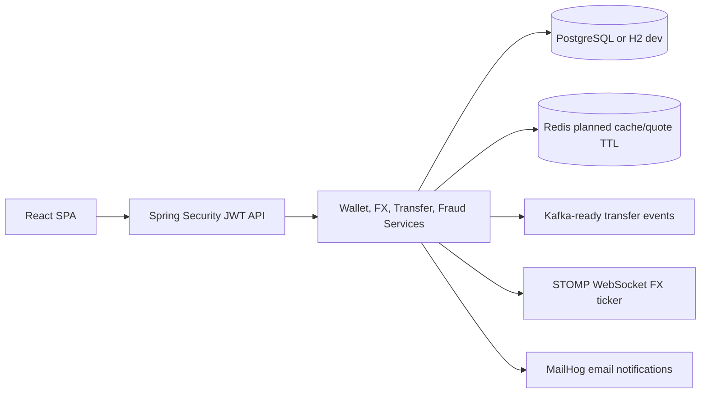

# FX Wallet — Cross-border Payments Platform

Full-stack fintech portfolio project based on the supplied project plan: Spring Boot 3, React 18, multi-currency wallets, FX quotes, transfers, fraud review, analytics, WebSocket rate ticker, Docker Compose, and CI.

## Run locally

Fast local run with persistent file database:

```bash
cd backend
mvn spring-boot:run -Dspring-boot.run.profiles=localdb
```

```bash
cd frontend
npm install
npm run dev
```

Frontend: http://localhost:5173  
Backend Swagger: http://localhost:8080/swagger-ui.html  
MailHog: http://localhost:8025

Persistent PostgreSQL run:

```bash
docker compose up -d postgres redis mailhog
cd backend
$env:SPRING_PROFILES_ACTIVE="postgres"
mvn spring-boot:run
```

Full Docker platform:

```bash
docker compose up --build
```

Demo users are seeded on first launch:

- `demo@fxwallet.local` / `Password123!`
- `admin@fxwallet.local` / `Password123!`

## Architecture



## Implemented modules

- Auth: registration, login, JWT access token, refresh token storage, OTP verification endpoint, 2FA placeholder endpoint.
- Wallets: default INR wallet on registration, additional INR/USD/EUR/GBP/AED/SGD wallets, balances, ledger mini-statements.
- FX: deterministic live-rate facade, 30-second quote locks, fee calculation, conversion, 7-day history chart data.
- Transfers: internal or external mock transfer, fee calculation, state transitions, email notification logging.
- Fraud: high-value and velocity rules, `REVIEW` state, admin approve/reject workflow.
- Analytics: spending by currency, monthly transfer volume, portfolio dashboard.
- Realtime: STOMP endpoint and scheduled `/topic/fx-rates` broadcaster.
- Realtime transfer/admin events: `/topic/transfers` and `/topic/admin/fraud-alerts`.

## Notes

The app supports a persistent local H2 database through the `localdb` profile and persistent PostgreSQL through the `postgres` Spring profile or the full Docker Compose stack. Redis and Kafka are included in Compose to match the plan; quote storage remains in-process for the local MVP, while realtime browser updates use Spring WebSocket/STOMP.
